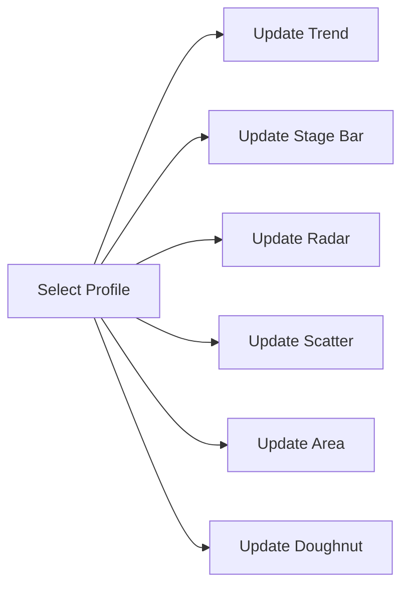
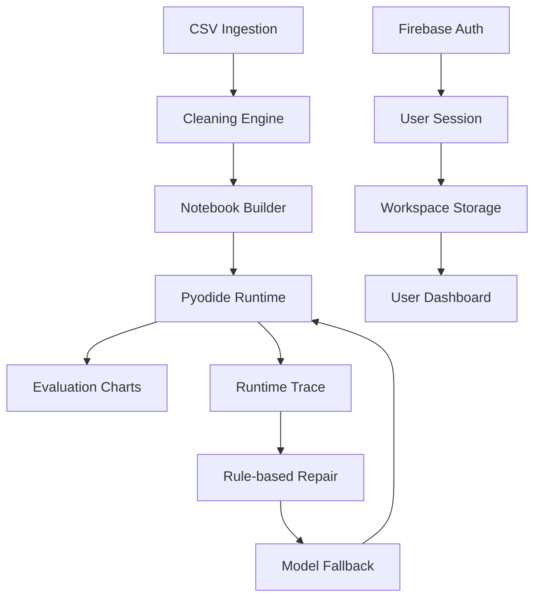
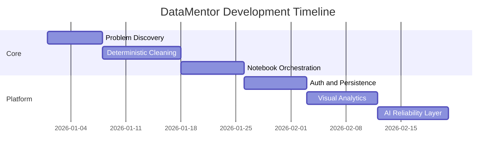

# DataMentor

Scientific web portal and application for reproducible CSV intelligence, notebook automation, and interactive analytics.

[](https://anis151993.github.io/Notebook-Studio/)
[](https://datamentor.marcbd.site)
[](https://nextjs.org/)
[](https://react.dev/)
[](https://www.typescriptlang.org/)
[](https://www.chartjs.org/)

## Live Links

- Portal: https://anis151993.github.io/Notebook-Studio/
- Overview anchor: https://anis151993.github.io/Notebook-Studio/index.html#overview
- Live app: https://datamentor.marcbd.site
- Repository: https://github.com/ANIS151993/Notebook-Studio

## Quick Navigation

1. [Project Snapshot](#1-project-snapshot)
2. [Single-Page Website Structure](#2-single-page-website-structure)
3. [Scientific Framework](#3-scientific-framework)
4. [All Graphs and Charts](#4-all-graphs-and-charts)
5. [Interactive Chart Profiles](#5-interactive-chart-profiles)
6. [Architecture Graph](#6-architecture-graph)
7. [Development Graph (Timeline)](#7-development-graph-timeline)
8. [Technology Stack](#8-technology-stack)
9. [Run Locally](#9-run-locally)
10. [Deployment Notes](#10-deployment-notes)
11. [Professional Profile](#11-professional-profile)

## 1) Project Snapshot

DataMentor provides:
- deterministic CSV cleaning,
- guided notebook orchestration,
- in-browser Python execution,
- hybrid runtime repair,
- interactive scientific evaluation charts,
- one unified documentation + research portal.

## 2) Single-Page Website Structure

The website (`docs/index.html`) is one integrated technical page with these sections:

- Overview
- Scientific Basis
- Development Steps
- Architecture
- Evaluation
- Research Brief
- Profiles and Contact

<details>
<summary><strong>Portal Interaction Features</strong></summary>

- Sticky section-aware navigation
- Clickable architecture module explorer
- Clickable development stage explorer with progress bar
- KPI counter animations
- Profile-based chart switching (Academic, SME, Enterprise)
- Multi-chart responsive analytics grid

</details>

## 3) Scientific Framework

### Problem
Real-world CSV workflows are frequently slow, fragmented, and non-reproducible.

### Hypothesis
A serverless deterministic pipeline with browser-native execution and hybrid repair can improve:
- productivity,
- reproducibility,
- runtime reliability.

### Evaluation Objectives
- Measure stage-level time savings versus manual baseline.
- Measure quality uplift across key data dimensions.
- Measure runtime repair outcomes and intervention rates.

## 4) All Graphs and Charts

All charts are present in the Evaluation section of the website and connected to profile switching.

| # | Chart | Type | Canvas ID | Main Signal |
|---|---|---|---|---|
| 1 | Processing Time Trend | Line | `trendChart` | Monthly processing-time reduction |
| 2 | Manual vs Automated Stage Time | Bar | `barChart` | Stage-by-stage efficiency comparison |
| 3 | Data Quality Radar | Radar | `radarChart` | Quality dimension uplift |
| 4 | Scalability Profile | Scatter | `scatterChart` | Size vs processing-time behavior |
| 5 | Cumulative Workflow Savings | Area/Line | `areaChart` | End-to-end cumulative time savings |
| 6 | Error Recovery Distribution | Doughnut | `doughnutChart` | Auto vs retry vs manual recovery share |

<details>
<summary><strong>Chart 1: Processing Time Trend (Line)</strong></summary>

- Purpose: show how workflow time changes over monthly periods.
- X-axis: time window (Jan-Aug).
- Y-axis: average processing time (minutes).
- Interaction: updates when chart profile changes.

</details>

<details>
<summary><strong>Chart 2: Manual vs Automated Stage Time (Bar)</strong></summary>

- Purpose: compare manual baseline against DataMentor per stage.
- Stages: ingestion, cleaning, validation, notebook prep, debugging.
- Interaction: side-by-side bars update by selected profile.

</details>

<details>
<summary><strong>Chart 3: Data Quality Radar (Radar)</strong></summary>

- Purpose: compare quality dimensions before and after automation.
- Dimensions: completeness, consistency, uniqueness, traceability, reusability.
- Interaction: profile-specific quality curves.

</details>

<details>
<summary><strong>Chart 4: Scalability Profile (Scatter)</strong></summary>

- Purpose: evaluate time growth as dataset size increases.
- X-axis: dataset size (x1000 rows).
- Y-axis: processing time (minutes).
- Interaction: profile-specific point distribution.

</details>

<details>
<summary><strong>Chart 5: Cumulative Workflow Savings (Area)</strong></summary>

- Purpose: compare accumulated manual vs automated minutes across stages.
- Visual: two filled lines showing cumulative divergence.
- Interaction: profile-based cumulative curves.

</details>

<details>
<summary><strong>Chart 6: Error Recovery Distribution (Doughnut)</strong></summary>

- Purpose: visualize runtime repair outcomes.
- Categories: auto-resolved, retry-resolved, manual intervention.
- Interaction: updates by profile scenario.

</details>

## 5) Interactive Chart Profiles

The chart toolbar supports three scenario profiles:
- `Academic Labs`
- `SME Operations`
- `Enterprise Analytics`

Switching profile updates all six charts together.



## 6) Architecture Graph



## 7) Development Graph (Timeline)



## 8) Technology Stack

- Next.js 16
- React 19
- TypeScript
- Chart.js
- Firebase Authentication + Firestore
- Papa Parse
- Pyodide

## 9) Run Locally

```bash
git clone https://github.com/ANIS151993/Notebook-Studio.git
cd Notebook-Studio
npm install
npm run dev
```

Build and lint:

```bash
npm run lint
npm run build
```

## 10) Deployment Notes

GitHub Pages portal files:
- `docs/index.html`
- `docs/styles.css`
- `docs/main.js`

Deployment flow:
1. Update docs files.
2. Commit and push to `main`.
3. GitHub Pages publishes the updated portal.

## 11) Professional Profile

Md Anisur Rahman Chowdhury  
Master's of Information Technology  
Dept. of Computer and Information Science, Gannon University, USA

Email:
- engr.aanis@gmail.com
- chowdhur014@gannon.edu

Profiles:
- LinkedIn: https://linkedin.com/in/md-anisur-rahman-chowdhury-15862420a
- GitHub: https://github.com/ANIS151993
- Google Scholar: https://scholar.google.com/citations?user=NQyywPoAAAAJ
- ResearchGate: https://researchgate.net/profile/Md-Anisur-Rahman-Chowdhury
- Portfolio: https://marcbd.com
