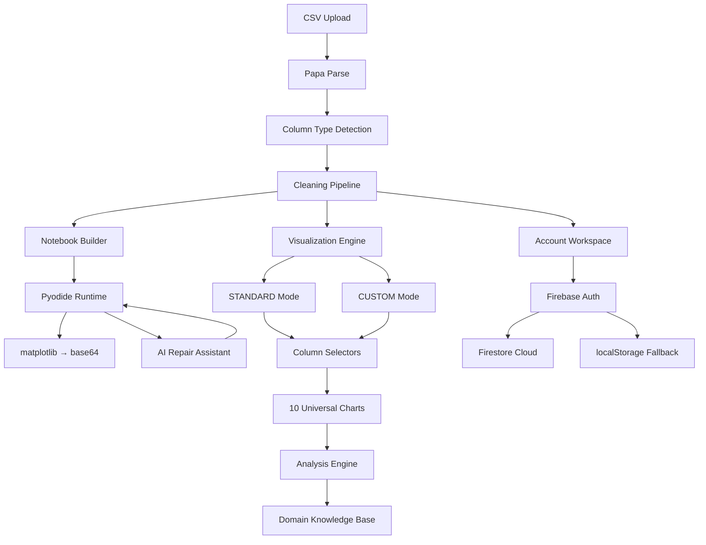
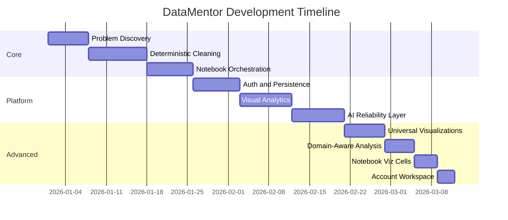

# DataMentor

Scientific web application for reproducible CSV intelligence, interactive visualizations, in-browser Python notebooks, and domain-aware data analysis.

[](https://anis151993.github.io/Notebook-Studio/)
[](https://datamentor.marcbd.site)
[](https://nextjs.org/)
[](https://react.dev/)
[](https://www.typescriptlang.org/)
[](https://www.chartjs.org/)
[](https://pyodide.org/)

## Live Links

- Portal: https://anis151993.github.io/Notebook-Studio/
- Live app: https://datamentor.marcbd.site
- Repository: https://github.com/ANIS151993/Notebook-Studio

## Quick Navigation

1. [What is DataMentor](#1-what-is-datamentor)
2. [Key Features](#2-key-features)
3. [Universal Visualizations](#3-universal-visualizations)
4. [Domain-Aware Analysis](#4-domain-aware-analysis)
5. [Interactive Python Notebook](#5-interactive-python-notebook)
6. [Architecture](#6-architecture)
7. [Technology Stack](#7-technology-stack)
8. [Claude Skill](#8-claude-skill)
9. [Run Locally](#9-run-locally)
10. [Portal Website](#10-portal-website)
11. [Development Timeline](#11-development-timeline)
12. [Professional Profile](#12-professional-profile)

## 1) What is DataMentor

DataMentor is a serverless, in-browser platform for CSV data analysis. Upload any CSV file and get:

- **Deterministic cleaning** — header normalization, whitespace trimming, duplicate removal, missing value handling
- **10 interactive chart types** — each with dynamic column selectors that adapt to your data
- **AI-powered analysis** — domain-aware insights generated from the columns you select
- **Python notebooks** — 14 guided code cells executing in-browser via Pyodide, including matplotlib visualizations
- **AI runtime repair** — automatic error detection and fix suggestions for notebook execution failures
- **Cloud persistence** — Firebase auth with Firestore save/load/delete for your analysis workspaces

## 2) Key Features

### Upload and Clean
- Drag-and-drop CSV upload with Papa Parse
- Automatic column type detection (numeric, categorical, boolean, datetime)
- Deterministic cleaning pipeline with transparent step-by-step display

### Visualize with Column Selectors
- **STANDARD mode**: 10 pre-configured chart panels, each with dropdown column selectors
- **CUSTOM mode**: pick any chart type and map your own columns
- Smart defaults — auto-selects the best columns for each chart type based on data

### Domain-Aware Analysis
- Knowledge-base engine that recognizes domain-specific columns (medical, financial, etc.)
- Generates contextual insights: statistical findings, suitability assessments, pair-wise relationships
- Updates dynamically whenever you change column selections

### In-Browser Python Execution
- Pyodide runtime with pandas, numpy, matplotlib, scipy pre-loaded
- 14 guided notebook cells from basic exploration to advanced visualizations
- Matplotlib plots rendered inline as base64 PNG images — no server required

### Account Workspace
- Firebase Google authentication
- Save, load, and delete uploaded CSV works
- Cloud (Firestore) and offline (localStorage) persistence

## 3) Universal Visualizations

All 10 chart types work with any CSV — no hardcoded data assumptions.

| Chart Type | Columns | Description |
|---|---|---|
| **DistPlot** | 1 numeric | Distribution histogram with KDE density curve |
| **Pie Chart** | 1 categorical/boolean | Proportional category breakdown |
| **Violin Plot** | 1 numeric + 1 categorical | Distribution shape comparison across groups |
| **HeatMap** | 2-8 numeric | Correlation matrix with annotated r-values |
| **PairPlot** | 2-10 numeric + optional group | NxN scatter/histogram grid with responsive scaling |
| **JointPlot** | 2 numeric | Scatter with marginal distributions and regression line |
| **Bar Chart** | 1 categorical + 1 numeric | Aggregated values by category |
| **Histogram** | 1 numeric | Frequency distribution with configurable bins |
| **Scatter Plot** | 2 numeric | Relationship between two continuous variables |
| **Line Chart** | 1 x-axis + 1 numeric | Trend visualization over ordered values |

### Responsive PairPlot Scaling

The PairPlot automatically adapts its layout based on the number of selected columns:
- 2 columns: fills available width at 320px cell height
- 3-4 columns: moderately scaled grid
- 5-6 columns: compact grid at 130px cell height
- 7+ columns: dense grid at 90px cell height with scaled fonts

## 4) Domain-Aware Analysis

The analysis engine (`lib/visualizationAnalysis.ts`) maintains a knowledge base of domain-specific column insights. When recognized columns are selected (e.g., `age`, `cholesterol`, `blood_pressure`), it generates:

- **Statistical insights** — mean, median, spread, skewness relative to domain thresholds
- **Clinical/domain context** — e.g., "Cholesterol above 200 mg/dL indicates elevated cardiovascular risk"
- **Pair-wise relationships** — e.g., "Age vs Cholesterol: cardiac risk increases with age-related lipid changes"
- **Chart suitability** — why the selected visualization is appropriate for the data

The analysis panel updates in real-time via `useMemo` whenever column selections change.

## 5) Interactive Python Notebook

14 guided cells covering the complete analysis workflow:

| # | Cell | What It Does |
|---|---|---|
| 1 | Load CSV | Import data with pandas |
| 2 | Shape & Info | Data dimensions and types |
| 3 | Descriptive Stats | Statistical summary |
| 4 | Missing Values | Null detection |
| 5 | Duplicates | Duplicate identification and removal |
| 6 | Correlation | Numeric correlation matrix |
| 7 | Value Counts | Category frequencies |
| 8 | DistPlot | matplotlib KDE + histogram visualization |
| 9 | Pie Chart | Auto-detected categorical pie chart |
| 10 | Violin Plot | Grouped distribution comparison |
| 11 | HeatMap | Annotated correlation heatmap |
| 12 | PairPlot | NxN scatter/histogram grid |
| 13 | JointPlot | Joint scatter with marginal histograms |
| 14 | Custom Code | Your own Python code |

### Inline Image Rendering

Matplotlib plots use the `AGG` backend, render to `BytesIO` buffers, encode as base64 PNG, and display inline via the `__IMG_BASE64__:` protocol — enabling full matplotlib visualizations without any server-side infrastructure.

## 6) Architecture



## 7) Technology Stack

| Layer | Technologies |
|---|---|
| **Framework** | Next.js 16 (Turbopack), React 19, TypeScript 5 |
| **Charts** | Chart.js 4.5.1, react-chartjs-2, chartjs-chart-matrix |
| **Python** | Pyodide 0.25.0 (pandas, numpy, matplotlib, scipy) |
| **Parsing** | Papa Parse 5.4.1 |
| **Auth/DB** | Firebase 10.12.5 (Auth + Firestore) |
| **Styling** | Tailwind CSS 4 |
| **Code Display** | react-syntax-highlighter |
| **DnD** | @dnd-kit (core, sortable, utilities) |

## 8) Claude Skill

**Build DataMentor yourself using the Claude Skill.**

The skill file contains the complete blueprint to recreate this application from scratch — including architecture, every component, implementation patterns, and step-by-step build instructions.

### Download

Download the skill file from this repository:

**[`datamentor-skill.md`](./datamentor-skill.md)**

### How to Use

1. Download `datamentor-skill.md` from this repository
2. Open Claude Code (CLI), Claude Desktop, or any Claude-powered tool
3. Provide the skill file as context and ask Claude to build the app
4. Follow the guided steps to customize for your use case

The skill covers:
- Complete project structure and dependencies
- CSV parsing and column type detection
- All 10 visualization types with column selectors
- Domain-aware analysis knowledge base
- Pyodide notebook with matplotlib rendering
- Firebase auth and persistence
- Account workspace with save/load/delete
- GitHub Pages portal site

## 9) Run Locally

```bash
git clone https://github.com/ANIS151993/Notebook-Studio.git
cd Notebook-Studio
npm install
npm run dev
```

Build and lint:

```bash
npm run lint
npm run build
```

### Environment Variables

Create `.env.local` with your Firebase config:

```
NEXT_PUBLIC_FIREBASE_API_KEY=your-api-key
NEXT_PUBLIC_FIREBASE_AUTH_DOMAIN=your-project.firebaseapp.com
NEXT_PUBLIC_FIREBASE_PROJECT_ID=your-project-id
NEXT_PUBLIC_FIREBASE_STORAGE_BUCKET=your-project.appspot.com
NEXT_PUBLIC_FIREBASE_MESSAGING_SENDER_ID=your-sender-id
NEXT_PUBLIC_FIREBASE_APP_ID=your-app-id
```

## 10) Portal Website

The GitHub Pages portal (`docs/`) is a single-page technical documentation site featuring:

- Sticky section-aware navigation
- Animated KPI counters
- Interactive development step explorer with progress bar
- Interactive architecture module explorer
- 6 evaluation charts with profile switching (Academic / SME / Enterprise)
- Video overview with lazy YouTube embed
- Research paper preview with encrypted download gate
- Claude Skill download section
- Professional profile and collaboration request builder

**Portal files:**
- `docs/index.html` — structure
- `docs/styles.css` — styling
- `docs/main.js` — interactivity

## 11) Development Timeline



## 12) Professional Profile

Md Anisur Rahman Chowdhury  
Master's of Information Technology  
Dept. of Computer and Information Science, Gannon University, USA

Email:
- engr.aanis@gmail.com
- chowdhur014@gannon.edu

Profiles:
- LinkedIn: https://linkedin.com/in/md-anisur-rahman-chowdhury-15862420a
- GitHub: https://github.com/ANIS151993
- Google Scholar: https://scholar.google.com/citations?user=NQyywPoAAAAJ
- ResearchGate: https://researchgate.net/profile/Md-Anisur-Rahman-Chowdhury
- Portfolio: https://marcbd.com
