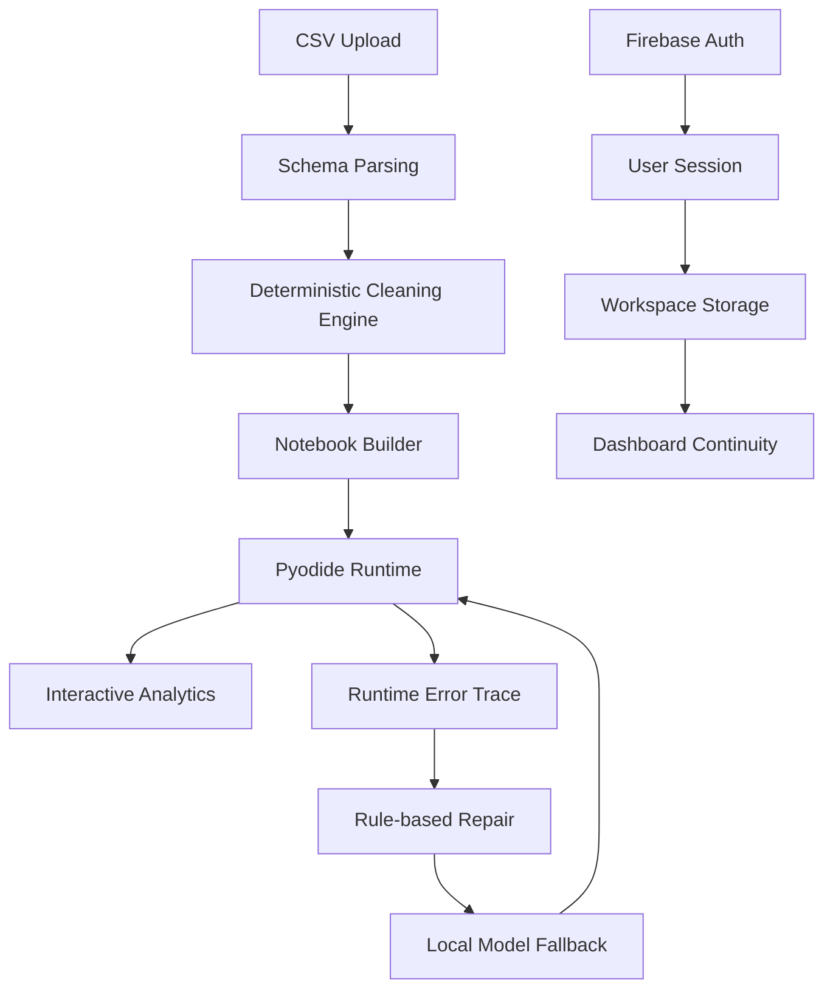

# DataMentor

DataMentor is a scientific and technical web portal for reproducible CSV intelligence, interactive notebook automation, and analytics evaluation.

Live website:
- https://anis151993.github.io/Notebook-Studio/
- Overview anchor: https://anis151993.github.io/Notebook-Studio/index.html#overview

Live application:
- https://datamentor.marcbd.site

Repository:
- https://github.com/ANIS151993/Notebook-Studio

## 1) What This Website Includes (Single-Page)

The website is designed as one integrated technical document with:
- Overview and research motivation
- Scientific basis and hypotheses
- Step-by-step development workflow explorer
- Interactive architecture explorer
- Experimental evaluation with interactive charts
- Integrated research brief (methodology, findings, limitations, references)
- Professional profiles and collaboration section

Primary source files:
- `docs/index.html`
- `docs/styles.css`
- `docs/main.js`

## 2) Core Scientific Framing

### Problem
Manual CSV workflows are often slow, inconsistent, and difficult to reproduce.

### Hypothesis
A deterministic, automation-first pipeline with browser-native execution and hybrid runtime repair can improve:
- preprocessing speed,
- output reproducibility,
- runtime reliability.

### Objectives
- Build deterministic CSV cleaning + notebook generation.
- Compare manual baseline vs DataMentor pipeline performance.
- Evaluate hybrid runtime repair behavior for notebook failures.

## 3) Step-by-Step Development Model

The website includes an interactive stage explorer with these phases:
1. Problem Discovery
2. Data Cleaning Engine
3. Notebook Orchestration
4. Authentication + Persistence
5. Visual Analytics
6. AI Reliability Layer

Each stage shows:
- engineering goal,
- implemented component,
- measurable outcome.

## 4) Interactive Architecture Modules

Interactive architecture coverage in the site:
- CSV Ingestion
- Cleaning Engine
- Notebook Builder
- Pyodide Runtime
- Firebase Auth
- Workspace Storage
- User Dashboard
- AI Repair Assistant

Each module exposes:
- inputs,
- outputs,
- reliability strategy.

## 5) Full Graph and Chart Suite

DataMentor now includes all evaluation charts in one interactive analytics block.

### Interactive profile switching
Users can dynamically switch chart profile contexts:
- Academic Labs
- SME Operations
- Enterprise Analytics

Switching updates all charts together for scenario-based evaluation.

### Chart inventory
| Chart | Purpose | Canvas ID |
|---|---|---|
| Processing Time Trend (Line) | Monthly processing-time evolution | `trendChart` |
| Manual vs Automated Stage Time (Bar) | Stage-level time comparison | `barChart` |
| Data Quality Radar (Radar) | Multi-metric quality shift | `radarChart` |
| Scalability Profile (Scatter) | Size vs processing-time behavior | `scatterChart` |
| Cumulative Workflow Savings (Area/Line Fill) | End-to-end cumulative time differences | `areaChart` |
| Error Recovery Distribution (Doughnut) | Repair outcome composition | `doughnutChart` |

### Graphical interactivity
- Animated chart rendering
- Scenario-aware dataset updates
- Responsive chart resizing
- Improved legend readability and contrast
- Hover-friendly point and segment emphasis

## 6) System Architecture (Conceptual)



## 7) Technology Stack

- Next.js 16 (App Router)
- React 19
- TypeScript
- Chart.js
- Firebase Authentication + Firestore
- Pyodide (in-browser Python)
- Papa Parse

## 8) Local Development

```bash
git clone https://github.com/ANIS151993/Notebook-Studio.git
cd Notebook-Studio
npm install
npm run dev
```

Build and lint:

```bash
npm run lint
npm run build
```

## 9) GitHub Pages / Docs Deployment Notes

This repository serves the portal from `docs/` for GitHub Pages.

Update flow:
1. Edit `docs/index.html`, `docs/styles.css`, and `docs/main.js`.
2. Commit and push to `main`.
3. GitHub Pages publishes updated portal.

## 10) Professional Profile

Md Anisur Rahman Chowdhury  
Master's of Information Technology  
Dept. of Computer and Information Science, Gannon University, USA

Email:
- engr.aanis@gmail.com
- chowdhur014@gannon.edu

Profiles:
- LinkedIn: https://linkedin.com/in/md-anisur-rahman-chowdhury-15862420a
- GitHub: https://github.com/ANIS151993
- Google Scholar: https://scholar.google.com/citations?user=NQyywPoAAAAJ
- ResearchGate: https://researchgate.net/profile/Md-Anisur-Rahman-Chowdhury
- Portfolio: https://marcbd.com
