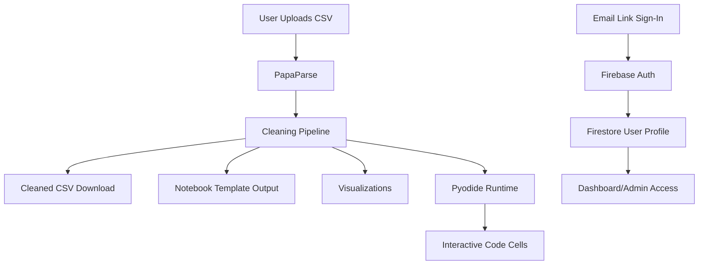

# Notebook Studio

Interactive CSV cleaning + in-browser Python notebook + passwordless authentication + dynamic data visualizations.

[](https://nextjs.org/)
[](https://react.dev/)
[](https://www.typescriptlang.org/)
[](https://firebase.google.com/)

GitHub repo: **https://github.com/ANIS151993/Notebook-Studio.git**

## Live User Guide Page

This project includes a built-in user-facing guide page:

- Open: `/live`
- Purpose: step-by-step instructions for users, feature walkthrough, and technology overview

---

## Table of Contents

1. [What This App Does](#what-this-app-does)
2. [How This Project Was Completed](#how-this-project-was-completed)
3. [User Journey (Step by Step)](#user-journey-step-by-step)
4. [Technology Stack](#technology-stack)
5. [Architecture](#architecture)
6. [Local Setup](#local-setup)
7. [Environment Variables](#environment-variables)
8. [Run, Build, Lint](#run-build-lint)
9. [Deployment Guidance](#deployment-guidance)
10. [Project Structure](#project-structure)
11. [Troubleshooting](#troubleshooting)

---

## What This App Does

Notebook Studio helps users:

- Upload raw CSV files
- Auto-clean headers/rows/duplicates
- Download cleaned CSV + generated `.ipynb`
- Run Python notebook cells directly in browser (Pyodide)
- Build visualizations from cleaned data
- Sign in via secure passwordless email link (Firebase)

---

## How This Project Was Completed

### Phase 1: Core CSV + Notebook Experience

- Built CSV upload and parsing flow using `PapaParse`
- Added cleaning pipeline:
  - normalize headers
  - trim values
  - remove empty rows
  - deduplicate rows
- Generated downloadable cleaned CSV + notebook template output

### Phase 2: Interactive In-Browser Notebook

- Integrated Pyodide runtime in the browser
- Added runnable code cells with:
  - execution output
  - error handling
  - editable/non-editable modes
  - cell-level explanations and AI helper panel

### Phase 3: Authentication + Protected Areas

- Implemented Firebase email-link login
- Added `/finish` link-completion route
- Synced users to Firestore (`createdAt`, `lastLoginAt`)
- Protected `/dashboard` and `/admin` flows

### Phase 4: Visual Analytics + UX Upgrade

- Added chart components and chart configuration layer
- Introduced interactive visuals tab
- Applied global UI system for:
  - glass cards
  - animated reveal transitions
  - hover lift effects
  - shimmer actions
  - route/page transitions

---

## User Journey (Step by Step)

1. Open home page (`/`)
2. Upload a CSV file
3. Wait for processing summary
4. Download:
   - cleaned CSV
   - generated notebook file
5. Open the Interactive Notebook tab
6. Run and edit Python cells
7. Explore Visualizations tab
8. Sign in with email link for protected dashboard/admin experiences

<details>
<summary><strong>Detailed User Flow (expand)</strong></summary>

- User selects `.csv`
- CSV is parsed and cleaned in client flow
- Cleaned dataset is available for:
  - downloads
  - notebook use
  - charts
- Pyodide loads and exposes Python runtime in-browser
- Users execute notebook cells incrementally
- Optional sign-in grants profile/dashboard/admin routes

</details>

---

## Technology Stack

| Layer | Tech |
|---|---|
| Frontend | Next.js App Router, React 19, TypeScript |
| Styling | Tailwind CSS 4 + custom animation utilities |
| CSV Parsing | PapaParse |
| In-Browser Python | Pyodide |
| Auth | Firebase Authentication (email link) |
| Database | Firestore |
| Charts | Chart.js + react-chartjs-2 |
| Tooling | ESLint, TypeScript, Next build pipeline |

---

## Architecture



---

## Local Setup

1. Clone repo

```bash
git clone https://github.com/ANIS151993/Notebook-Studio.git
cd Notebook-Studio
```

2. Create env file

```bash
cp .env.local.example .env.local
```

3. Install dependencies

```bash
npm install
```

4. Run development server

```bash
npm run dev
```

5. Open app

- Home: `http://localhost:3000`
- Live guide page: `http://localhost:3000/live`

---

## Environment Variables

Set these in `.env.local`:

- `NEXT_PUBLIC_FIREBASE_API_KEY`
- `NEXT_PUBLIC_FIREBASE_AUTH_DOMAIN`
- `NEXT_PUBLIC_FIREBASE_PROJECT_ID`
- `NEXT_PUBLIC_FIREBASE_STORAGE_BUCKET`
- `NEXT_PUBLIC_FIREBASE_MESSAGING_SENDER_ID`
- `NEXT_PUBLIC_FIREBASE_APP_ID`
- `NEXT_PUBLIC_FIREBASE_MEASUREMENT_ID` (optional)
- `NEXT_PUBLIC_APP_URL` (example: `http://localhost:3000`)

---

## Run, Build, Lint

```bash
npm run dev
npm run lint
npm run build
npm run start
```

---

## Deployment Guidance

### Option A: Vercel

- Import repo in Vercel
- Set environment variables
- Deploy

### Option B: Firebase Hosting

- Build app: `npm run build`
- Configure hosting + deploy with Firebase CLI

---

## Project Structure

```txt
app/
  page.tsx
  live/page.tsx
  login/page.tsx
  finish/page.tsx
  dashboard/page.tsx
  admin/page.tsx
  api/ipynb-template/route.ts
components/
  CsvNotebookBuilder.tsx
  NotebookViewer.tsx
  CodeCell.tsx
  CsvVisualizations.tsx
  charts/*
hooks/
  usePyodide.ts
lib/
  firebase.ts
  chartConfig.ts
  chartDataProcessor.ts
  ...
```

---

## Troubleshooting

### Firebase config errors

- Ensure all required `NEXT_PUBLIC_FIREBASE_*` values exist
- Restart dev server after env updates

### Pyodide load issues

- Check browser/network policy for CDN access
- Refresh page after first load; initial runtime download can be slower

### Charts not appearing

- Confirm cleaned CSV has valid rows and typed columns
- Check browser console for data-shape issues

---

## License

Use your preferred project license (MIT recommended).
